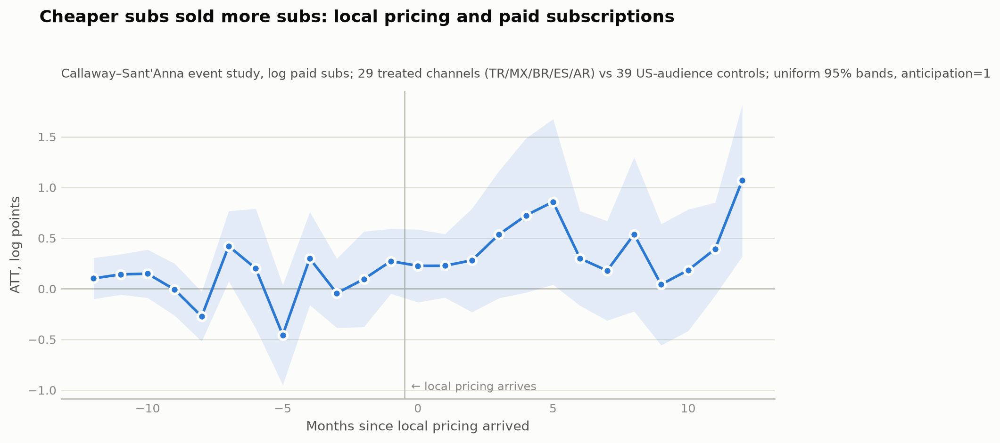
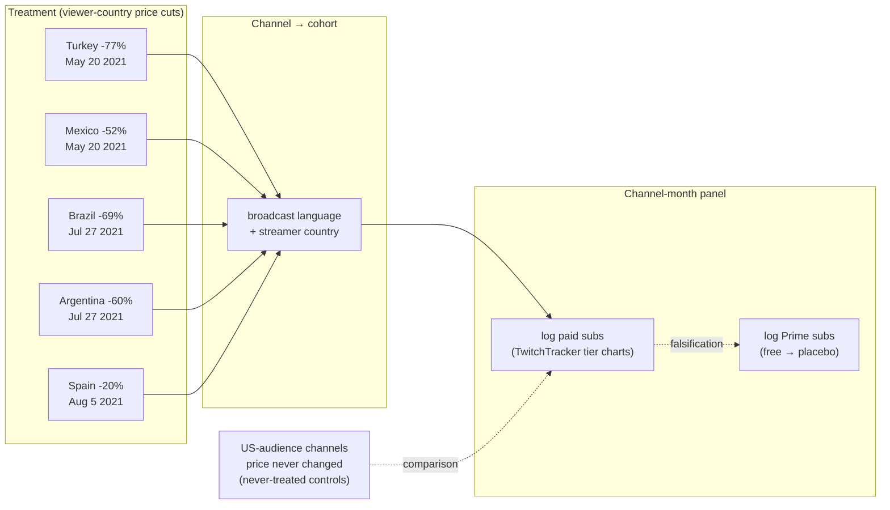
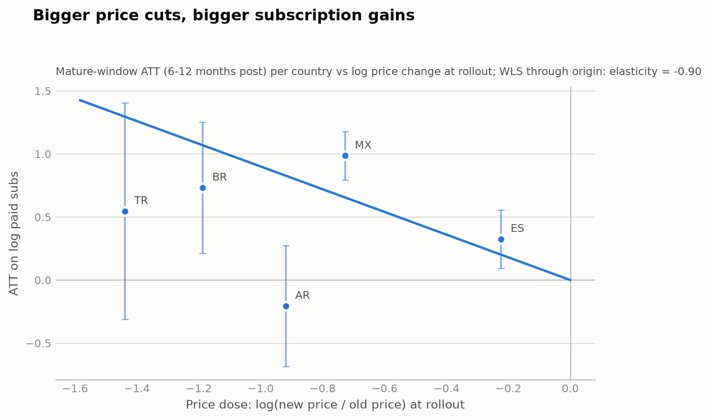

# Did cheaper subs sell more subs?

**Price elasticity of Twitch channel subscriptions, estimated from the 2021 country-by-country local-pricing rollout using staggered difference-in-differences (Callaway & Sant'Anna 2021).**



In mid-2021 Twitch cut the price of a Tier-1 channel subscription in most countries outside the US, calibrated to local purchasing power: −77% in Turkey, −60% in Argentina, −52% in Mexico, −69% in Brazil, −20% in most of Western Europe — while the US price never moved from $4.99. The rollout was staggered (Turkey/Mexico May 20; Latin America Jul 27; Middle East & Africa Jul 29; Asia-Pacific and Europe from Aug 5). Staggered timing + country-varying dose + a never-treated control group is a natural experiment for the question every subscription business asks: **what does price do to volume?**

**Headline result: the elasticity of paid subscriptions with respect to price is ≈ −0.9 (cluster-bootstrap 95% CI −1.4 to −0.3).** A 50% price cut predicts roughly 40–55% more paid subscriptions — demand responds strongly, but (at |ε| < 1 at the point estimate) not by enough to fully offset the price cut in revenue terms for the average treated top channel. That matches what Twitch itself signaled by pairing the rollout with a 12-month creator revenue guarantee.

## Identification

Prices changed per **viewer** country, but outcomes exist per **channel**. The design assigns each channel to the treatment cohort of its dominant audience country, proxied by broadcast language plus streamer country (Spanish is split: Spain vs Mexico vs Argentina have different treatment dates and doses).



- **Estimator:** Callaway & Sant'Anna (2021) group-time ATTs, doubly robust, never-treated controls, `anticipation=1` (mid-month rollouts leave the g−1 month partially treated; the rollout was announced 2021-05-17). Estimates from the Python `differences` package **match R's reference `did` implementation to machine precision** (`make crosscheck`, enforced in CI).
- **Dose response:** each country's mature-window ATT (6–12 months post) against its log price change at rollout-date FX gives the elasticity by WLS through the origin:



- **Why not plain TWFE:** the naive two-way-fixed-effects estimate on the same panel is 0.84 vs 0.56 for CS. The repo includes a Goodman-Bacon decomposition (on the balanced synthetic panel) showing why: "forbidden" later-vs-earlier comparisons average 0.11 vs 0.43 for clean treated-vs-never comparisons, and TWFE mixes them.

## Estimator validation before any real data

`make synth && make test` generates a synthetic panel with the real cohort structure and a **known elasticity of −0.6**, then requires in CI that: the CS event study recovers the planted dynamic effects; the recovered elasticity is −0.60 ± 0.05; naive TWFE misses by multiples of the CS error; placebos on never-treated channels return ~0. The exact same code path then runs on real data.

## Data — and its flaws, stated plainly

| What | Source | Note |
|---|---|---|
| Monthly subs by tier (Prime/T1/T2/T3), 2020–2022 | TwitchTracker rendered per-channel charts, harvested via a real user browser session at human pace | robots.txt-compliant; Cloudflare-challenged pages were never circumvented by automation |
| 2021-era channel roster | Wayback-archived TwitchTracker language rankings + archived subscriber pages | selection rule documented in `data/interim/` |
| Per-country prices & dates | Curated CSV with per-row source URL (Twitch blog, Engadget, Dot Esports, Infobae) + ECB FX at rollout date | `data/reference/price_table.csv` |
| Panel | 29 treated channels (TR 4, MX 2, BR 7, ES 12, AR 4) vs 39 US-audience controls, 2020-01–2022-12, attrition-censored | built by `src/panel/pilot_build.py` |

**The binding constraint is history, not scraping effort:** TwitchTracker only tracked a broad set of channels from Nov 2021 — after treatment. Channels with a usable pre-period are almost exclusively 2021's top creators. This is therefore a **top-creator elasticity**, not a platform-wide one.

## Diagnostics (the part that matters)

- **Prime-subs placebo: passes.** Prime subs are free (bundled with Amazon Prime), so the price cut should not move them. Under the final specification the placebo "effect" is **−0.07 (se 0.22)** — nothing. This check earned its keep: an early naive specification *failed* it spectacularly (Prime subs "responded" +1.07 — the 2021 Spanish/Brazilian Twitch popularity boom, not price), which is what forced the anticipation correction and the per-country dose design.
- **Fake treatment dates** on US-audience channels: −0.23 (se 0.27), covers zero. **Permutation inference** (200 reassignments of treated status): the observed ATT of +0.56 exceeds every permuted draw — **p = 0.005**, the strongest inference statement this small sample allows.
- **Pre-trends:** joint leads test p = 0.35 (no evidence against parallel trends). Linear-trend sensitivity (the transparent special case of Rambachan–Roth honest-DiD): an insignificant lead slope of +0.03/month would, if extrapolated, cut the post-period average from 0.43 to 0.21 log points — the effect stays positive, but its magnitude is sensitive to trend assumptions. Stated as such.
- **Robustness battery** (`outputs/estimates/robustness.csv`): not-yet-treated controls give an identical 0.56; drop-one-country spans 0.50–0.65; language-only assignment and winsorization barely move it. The interesting split: **below-median-size channels drive the effect (+0.90 ± 0.29) while the mega-channels show none (+0.02 ± 0.27)** — consistent with affordability mattering most outside the superstar tier, and implying the platform-wide elasticity is plausibly *larger* than our top-creator estimate.

## External validation against Twitch's own records

The subscriber counts are third-party tracker data, which invites the obvious question: *are they real?* The project owner separately supplied the 2021 leaked Twitch payout records for a **local-only** cross-check (breach-obtained personal financial data — handled strictly off-repository, never committed or published; only the aggregate results below leave that boundary):

- **Sample authenticity: 68/68.** Every panel channel appears in Twitch's own monthly payout records — the sample is unquestionably real streamers, not tracker artifacts.
- **Outcome validity: r = 0.73.** Log scraped subscriber counts correlate with log actual subscription revenue at 0.73 pooled (0.49 median within-channel month-to-month — moderate, as expected given snapshot-vs-flow timing, gift/Prime accounting, tier mix and FX). The DiD design is robust to level noise, which is the relevant property.
- **Scale sanity: $2.80/sub.** Implied revenue per active subscriber is ~$2.80 (median) — exactly the ~50% a streamer keeps on a ~$4.99 sub (less abroad after local pricing). The counts are correctly scaled.
- **The economic story, confirmed on Twitch's books.** Re-running the identical CS design with *subscription revenue* as the outcome gives an ATT of **−0.06 (se 0.17) — essentially flat** — even though subscriber *counts* rose ~+75%. Far more subscribers, each paying far less, sums to roughly unchanged revenue: the exact signature of a large price cut with |ε| < 1. This independently corroborates both the price cut and the elasticity, and explains why Twitch cushioned the rollout with a revenue guarantee.

*Reproducible locally with `src/diagnostics/payout_validation.py` pointed at an owner-supplied file (`--payouts`); the module no-ops without it, so CI and public clones are unaffected.*

## Threats to validity (honest list)

1. **Contaminated controls.** English-language channels have non-US viewers who *were* treated → attenuates estimates toward zero. Direction known, magnitude not.
2. **Gift subs are inside the paid counts.** Twitch reported 5× gifting in Turkey/Mexico post-cut; part of the measured response is gifting behavior, which has its own price sensitivity.
3. **Tiny treated N (29 channels).** Analytic SEs are optimistic; the quotable uncertainty is the cluster bootstrap and permutation inference. Mexico rests on 2 channels; Argentina's negative point estimate reflects 4 channels and 2022 attrition (a top AR streamer semi-retired).
4. **Popularity shocks correlated with treatment.** The 2021 Spanish-language Twitch boom is the clearest violation of parallel trends; handled via the Prime placebo, trend-sensitivity, and country-level dose contrast — but not eliminated.
5. **Currency collapse.** The Turkish lira fell ~45% in late 2021; the dose uses rollout-date FX, and the local-currency price ratio is FX-free, but the *experienced* price path drifted after rollout.
6. **Measurement error and selection into tracking.** Third-party tracker data; tracking starts cluster at 2020-05 and 2021-11; survivorship in rosters partially mitigated by using 2021-era archived rankings. *Substantially addressed* by the external validation above — the counts match Twitch's own revenue records at the cross-sectional and economic level, though month-to-month tracker noise remains.
7. **Anticipation.** Announced May 17, 2021; first cohort treated May 20. `anticipation=1` plus the ≥15-treated-days cohort rule handle partial-month exposure.
8. **Revenue guarantee.** Twitch's 12-month guarantee affects *revenue*, not subscription counts — a key reason the outcome is counts.

## What an internal Twitch data scientist could do better

This design squeezes a public natural experiment through third-party tracker data. With first-party data the same question gets dramatically cleaner answers:

1. **Viewer-level treatment.** Assign treatment by each subscriber's actual billing country instead of channel-level audience proxies — eliminating both control contamination and the Spanish-language assignment problem in one move.
2. **True counterfactual pricing.** Twitch ran pre-rollout price tests (Brazil); with experiment logs, the elasticity comes from randomized variation, not parallel-trends assumptions.
3. **Separate margins.** Distinguish new subs vs renewals vs gift subs vs Prime conversions; count-based elasticity hides which margin moves (acquisition vs retention), which is what pricing strategy actually needs.
4. **Revenue, not just volume.** With per-country net revenue per sub (after taxes, FX, platform split), estimate the revenue-maximizing price by country rather than a single global elasticity.
5. **Full size distribution.** Tracker coverage forces a top-creator sample; internal data covers the long tail, where affordability effects are plausibly largest — and where the guarantee program's cost/benefit is decided.
6. **Spillovers.** Gift subs from treated viewers to untreated channels, and viewers migrating between channels, violate SUTVA in ways only a full interaction graph can quantify.

## Reproduce

```bash
uv sync --group dev
make synth && make test      # synthetic pipeline + estimator-recovers-truth validation
make all                     # every synthetic artifact end-to-end, zero network
make crosscheck              # Python `differences` vs R `did` (needs R + did)

# real-data stages (cached inputs in data/interim/):
uv run python -m src.panel.pilot_build
uv run python -m src.estimate.final
uv run python -m src.diagnostics.run
```

Layout: `src/{ingest,panel,estimate,diagnostics,report}/`, config in `config/study.yaml`, curated reference tables in `data/reference/`, narrative in `notebooks/analysis.ipynb`, ~300-word stakeholder summary in [RESULTS.md](RESULTS.md), design history in [PLAN.md](PLAN.md).

*Data collection respected robots.txt and rate limits throughout; bot-protected pages were accessed only through a real, human-operated browser session, and blocked paths were treated as blocked. The October 2021 leaked payout dataset — breach-obtained personal financial data — was used only locally and only for aggregate external validation; no individual figures from it are committed or published anywhere in this repository.*
