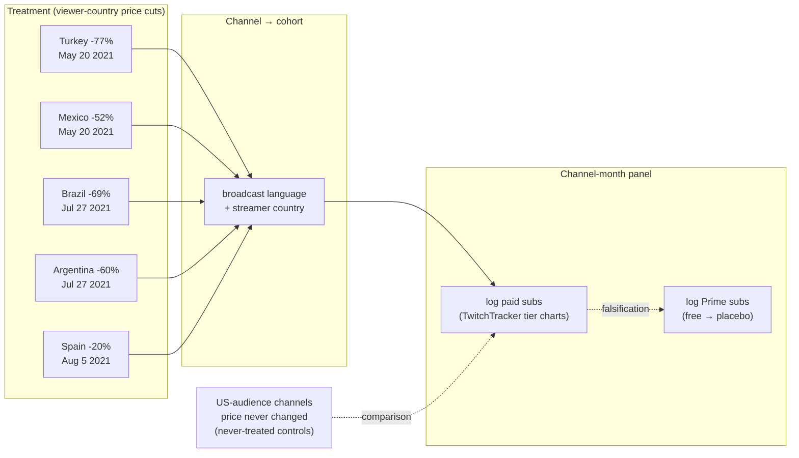

# Monetizing Elasticity: Case Study of Dynamic Subscription Pricing

A causal-inference study that treats Twitch's 2021 country-by-country subscription price cut as a natural experiment, estimating a price elasticity of paid subscriptions of **≈ −0.9** using a modern staggered difference-in-differences estimator (Callaway & Sant'Anna 2021). The repository is a fully reproducible pipeline: scraping → panel construction → estimation → diagnostics → reporting.


In mid-2021 Twitch cut the price of a Tier-1 channel subscription in most countries outside the US, calibrated to local purchasing power: −77% in Turkey, −60% in Argentina, −52% in Mexico, −69% in Brazil, −20% in most of Western Europe — while the US price never moved from $4.99. The rollout was staggered (Turkey/Mexico May 20; Latin America Jul 27; Middle East & Africa Jul 29; Asia-Pacific and Europe from Aug 5). Staggered timing, country-varying dose, and a never-treated control group together make this a natural experiment for the question every subscription business asks: what does price do to volume?

**Headline result:** the elasticity of paid subscriptions with respect to price is ≈ −0.9 (cluster-bootstrap 95% CI −1.4 to −0.3). A 50% price cut predicts roughly 40–55% more paid subscriptions — demand responds strongly, but at |ε| < 1 not enough to fully offset the price cut in revenue terms for the average treated top channel.

## Identification Strategy

Prices changed per **viewer** country, but outcomes exist per **channel**. Each channel is assigned to the treatment cohort of its dominant audience country, proxied by broadcast language plus streamer country (Spanish is deliberately split: Spain, Mexico and Argentina have different treatment dates and doses).



Design details that the data forced:

- `anticipation=1`, because mid-month rollouts leave the g−1 month partially treated and the rollout was announced 2021-05-17.
- A ≥15-treated-days rule for assigning a channel-month to a cohort.
- Rollout-date ECB FX for the dose variable, so the price change is measured at the exchange rate in force when the cut landed.

## Estimation

- **Primary estimator:** Callaway & Sant'Anna (2021) group-time ATTs, doubly robust, never-treated controls. Implemented via the Python `differences` package behind a thin wrapper (`src/estimate/cs.py`) that normalizes the backend's MultiIndex output into flat, stable schemas so downstream code never touches library internals.
- **Cross-language verification:** `make crosscheck` runs the same specification through R's reference `did` implementation and requires machine-precision agreement. Enforced in CI.
- **Two-stage dose response:** cohort mature-window ATTs (6–12 months post) are regressed on each country's log price change by WLS through the origin, which recovers the elasticity.


- **Why not plain TWFE:** naive two-way fixed effects on the same panel gives 0.84 vs 0.56 for CS. A Goodman-Bacon decomposition (on the balanced synthetic panel) shows why: the "forbidden" later-vs-earlier comparisons average 0.11 against 0.43 for clean treated-vs-never comparisons, and TWFE mixes them.

## Estimator Validation

`make synth && make test` generates a synthetic panel with the real cohort structure and a **planted elasticity of −0.6**, then requires in CI that:

- the CS event study recovers the planted dynamic effects,
- the recovered elasticity is −0.60 ± 0.05,
- naive TWFE misses by multiples of the CS error,
- placebos on never-treated channels return ~0.

The synthetic DGP is heterogeneous, dose-proportional and ramped — precisely the regime where TWFE breaks — and includes a covariate so the doubly-robust path has real work to do. The identical code path then runs on real data.

## Data

| What | Source | Note |
|---|---|---|
| Monthly subs by tier (Prime/T1/T2/T3), 2020–2022 | TwitchTracker rendered per-channel charts, harvested via a real user browser session at human pace | robots.txt-compliant; Cloudflare-challenged pages were never circumvented by automation |
| 2021-era channel roster | Wayback-archived TwitchTracker language rankings + archived subscriber pages | avoids survivorship bias from picking today's top channels; selection rule documented in `data/interim/` |
| Per-country prices & dates | Curated CSV with per-row source URL (Twitch blog, Engadget, Dot Esports, Infobae) + ECB FX at rollout date | `data/reference/price_table.csv` |
| Panel | 29 treated channels (TR 4, MX 2, BR 7, ES 12, AR 4) vs 39 US-audience controls, 2020-01–2022-12, attrition-censored | built by `src/panel/pilot_build.py` |

**The binding constraint is history, not scraping effort.** TwitchTracker only tracked a broad set of channels from Nov 2021 — after treatment. Channels with a usable pre-period are almost exclusively 2021's top creators, so this is a **top-creator elasticity**, not a platform-wide one.

## Diagnostics and Inference

- **Prime-subs placebo: passes.** Prime subs are free (bundled with Amazon Prime), so the price cut should not move them. Under the final specification the placebo effect is **−0.07 (se 0.22)** — nothing. This check earned its keep: an early naive specification *failed* it spectacularly (Prime subs "responded" +1.07, driven by the 2021 Spanish/Brazilian Twitch popularity boom, not price), which is what forced the anticipation correction and the per-country dose design.
- **Fake treatment dates** on US-audience channels: −0.23 (se 0.27), covers zero.
- **Permutation inference:** across 200 reassignments of treated status the observed ATT of +0.56 exceeds every permuted draw — **p = 0.005**, the strongest inference statement this sample size allows. With 29 treated channels analytic SEs are optimistic, so the quotable uncertainty is the cluster bootstrap and this permutation test.
- **Pre-trends:** joint leads test p = 0.35 (no evidence against parallel trends). A linear-trend sensitivity analysis — the transparent special case of Rambachan–Roth honest DiD — shows an insignificant lead slope of +0.03/month would, if extrapolated, cut the post-period average from 0.43 to 0.21 log points. The effect stays positive, but its magnitude is trend-sensitive, and is reported as such.
- **Robustness battery** (`outputs/estimates/robustness.csv`): not-yet-treated controls give an identical 0.56; drop-one-country spans 0.50–0.65; language-only assignment and winsorization barely move it. The interesting split: **below-median-size channels drive the effect (+0.90 ± 0.29) while mega-channels show none (+0.02 ± 0.27)** — consistent with affordability mattering most outside the superstar tier, and implying the platform-wide elasticity is plausibly *larger* than this top-creator estimate.

## External Validation

The subscriber counts are third-party tracker data, which invites the obvious question: are they real? The project owner separately supplied the 2021 leaked Twitch payout records for a **local-only** cross-check. This is breach-obtained personal financial data, handled strictly off-repository and never committed or published; only the aggregate results below leave that boundary. `src/diagnostics/payout_validation.py` takes an owner-supplied file path (`--payouts`) and no-ops without it, so CI and public clones are unaffected.

- **Sample authenticity: 68/68.** Every panel channel appears in Twitch's own monthly payout records — the sample is real streamers, not tracker artifacts.
- **Outcome validity: r = 0.73.** Log scraped subscriber counts correlate with log actual subscription revenue at 0.73 pooled (0.49 median within-channel month-to-month — moderate, as expected given snapshot-vs-flow timing, gift/Prime accounting, tier mix and FX). The DiD design is robust to level noise, which is the relevant property.
- **Scale sanity: $2.80/sub.** Implied revenue per active subscriber is ~$2.80 (median) — the ~50% a streamer keeps on a ~$4.99 sub (less abroad after local pricing). The counts are correctly scaled.
- **Independent confirmation of the elasticity.** Re-running the identical CS design with *subscription revenue* as the outcome gives an ATT of **−0.06 (se 0.17) — essentially flat** — even though subscriber *counts* rose ~+75%. Far more subscribers each paying far less, summing to roughly unchanged revenue, is the exact arithmetic signature of a large price cut with |ε| < 1. A completely different data source corroborates the headline estimate.

## Threats to Validity

1. **Contaminated controls.** English-language channels have non-US viewers who *were* treated → attenuates estimates toward zero. Direction known, magnitude not.
2. **Gift subs are inside the paid counts.** Twitch reported 5× gifting in Turkey/Mexico post-cut; part of the measured response is gifting behavior, which has its own price sensitivity.
3. **Tiny treated N (29 channels).** Analytic SEs are optimistic. Mexico rests on 2 channels; Argentina's negative point estimate reflects 4 channels and 2022 attrition (a top AR streamer semi-retired).
4. **Popularity shocks correlated with treatment.** The 2021 Spanish-language Twitch boom is the clearest potential violation of parallel trends; handled via the Prime placebo, trend sensitivity, and country-level dose contrast — but not eliminated.
5. **Currency collapse.** The Turkish lira fell ~45% in late 2021; the dose uses rollout-date FX and the local-currency price ratio is FX-free, but the *experienced* price path drifted after rollout.
6. **Measurement error and selection into tracking.** Tracking starts cluster at 2020-05 and 2021-11; survivorship in rosters is partially mitigated by using 2021-era archived rankings. Substantially addressed by the external validation above, though month-to-month tracker noise remains.
7. **Anticipation.** Announced May 17, 2021; first cohort treated May 20. `anticipation=1` plus the ≥15-treated-days cohort rule handle partial-month exposure.
8. **Revenue guarantee.** Twitch's 12-month creator revenue guarantee affects *revenue*, not subscription counts — a key reason the primary outcome is counts.

## Scope for Improvement

The design squeezes a public natural experiment through third-party tracker data. Access to first-party platform data would sharpen the same question considerably:

1. **Viewer-level treatment assignment.** Assigning treatment by each subscriber's actual billing country instead of channel-level audience proxies would eliminate both control contamination and the Spanish-language assignment problem at once.
2. **True counterfactual pricing.** Twitch ran pre-rollout price tests (Brazil); with experiment logs the elasticity comes from randomized variation rather than parallel-trends assumptions.
3. **Separating margins.** Distinguishing new subs, renewals, gift subs and Prime conversions would show which margin moves — acquisition or retention — which is what pricing strategy actually needs.
4. **Revenue, not just volume.** With per-country net revenue per sub (after taxes, FX, platform split), one could estimate a revenue-maximizing price by country rather than a single global elasticity.
5. **Full size distribution.** Tracker coverage forces a top-creator sample; broader coverage would reach the long tail, where affordability effects are plausibly largest.
6. **Spillovers.** Gift subs from treated viewers to untreated channels, and viewers migrating between channels, violate SUTVA in ways only a full interaction graph can quantify.

## Engineering

- **Pipeline architecture.** `src/{ingest,panel,estimate,diagnostics,report}/` with a single YAML config (`config/study.yaml`) and a Makefile where every artifact is regenerable — `make all` runs end-to-end with zero network access.
- **Typed, defensive estimation code.** Dataclass result types, keyword-only overrides for robustness variants, and defensive handling such as dropping zero-variance covariates that would make the doubly-robust design singular.
- **Tooling.** Pinned dependencies via `uv`, plus `ruff`, `mypy` and `pytest` with HTML fixtures for the scraper parsers, all enforced in CI.
- **Privacy boundary as code.** The payout validation module is designed so that sensitive breach-obtained data never enters the repository or CI — the file path is supplied at runtime and the module no-ops without it.
- **Data acquisition.** Wayback Machine reconstruction of a 2021-era channel roster, browser-session scraping of rendered charts within robots.txt and rate limits, a curated price table with per-row source URLs, and ECB FX at rollout dates.

## Reproduce

```bash
uv sync --group dev

make synth && make test      # synthetic pipeline + estimator-recovers-truth validation
make all                     # every synthetic artifact end-to-end, zero network
make crosscheck              # Python `differences` vs R `did` (needs R + did)
make lint typecheck          # ruff + mypy

# real-data stages (cached inputs in data/interim/):
uv run python -m src.panel.pilot_build
uv run python -m src.estimate.final
uv run python -m src.diagnostics.run
```

Layered write-ups: this technical README, a ~300-word stakeholder summary in [RESULTS.md](RESULTS.md), a narrative walkthrough in `notebooks/analysis.ipynb`, design history in [PLAN.md](PLAN.md), and a guided site in `docs/`.

---

```text
root/
├── Makefile                          # Every artifact regenerable; `make all` is network-free
├── pyproject.toml                    # Pinned deps (uv), ruff/mypy/pytest config
├── config/
│   └── study.yaml                    # Single source of truth for the study parameters
├── data/
│   ├── raw/                          # Untouched scrape output
│   ├── cache/                        # Rendered-page cache for the browser scraper
│   ├── interim/                      # Rosters and intermediate selections
│   ├── processed/                    # Analysis panels (synthetic + real, parquet)
│   └── reference/
│       ├── price_table.csv           # Per-country prices/dates with source URLs
│       ├── fx_rates.csv              # ECB rates at rollout dates
│       └── channel_country_map.csv   # Channel → audience-country assignment
├── src/
│   ├── config.py                     # YAML config loading and typed settings
│   ├── ingest/
│   │   ├── browser.py                # Human-paced browser session driver
│   │   ├── parsers.py                # HTML/chart parsers (fixture-tested)
│   │   ├── roster.py                 # Channel roster construction
│   │   ├── wayback.py                # 2021-era archive reconstruction
│   │   ├── cache.py                  # On-disk page cache
│   │   ├── pilot.py                  # Pilot-sample ingestion driver
│   │   └── payouts_optional.py       # Optional, owner-supplied payout loader
│   ├── panel/
│   │   ├── synthetic.py              # Synthetic DGP with planted elasticity
│   │   ├── pilot_build.py            # Real channel-month panel builder
│   │   ├── prices.py                 # Price/dose construction with rollout FX
│   │   ├── months.py                 # Cohort assignment, ≥15-treated-days rule
│   │   └── schema.py                 # Panel schema definitions
│   ├── estimate/
│   │   ├── cs.py                     # Callaway & Sant'Anna wrapper (flat schemas)
│   │   ├── twfe.py                   # Naive TWFE comparison
│   │   ├── bacon.py                  # Goodman-Bacon decomposition
│   │   ├── dose.py                   # Cohort ATT → dose response
│   │   ├── elasticity.py             # WLS-through-origin elasticity
│   │   ├── r_crosscheck.py           # Python vs R `did` machine-precision check
│   │   ├── run.py                    # Synthetic-panel estimation entrypoint
│   │   └── final.py                  # Real-panel estimation entrypoint
│   ├── diagnostics/
│   │   ├── placebos.py               # Prime-subs and fake-date placebos
│   │   ├── pretrends.py              # Joint leads test + trend sensitivity
│   │   ├── robustness.py             # Robustness battery
│   │   ├── payout_validation.py      # Local-only external validation (no-ops w/o file)
│   │   └── run.py                    # Diagnostics entrypoint
│   └── report/
│       └── figures.py                # Event-study and dose-response figures
├── scripts/
│   └── crosscheck.R                  # R reference implementation
├── tests/
│   ├── test_estimator_validation.py  # CS recovers planted truth; TWFE does not
│   ├── test_synth.py                 # Synthetic DGP properties
│   ├── test_bacon.py                 # Decomposition correctness
│   ├── test_prices.py                # Price/dose construction
│   ├── test_months.py                # Cohort assignment rules
│   ├── test_ingest.py                # Parser tests against HTML fixtures
│   └── fixtures/                     # Saved TwitchTracker HTML
├── outputs/
│   ├── estimates/                    # ATTs, dose response, robustness, diagnostics
│   └── figures/                      # Event study, dose response, placebo plots
├── notebooks/
│   └── analysis.ipynb                # Executed narrative walkthrough
├── docs/                             # Guided walkthrough site
├── RESULTS.md                        # ~300-word stakeholder summary
├── PLAN.md                           # Design history
└── README.md
```

---

*Data collection respected robots.txt and rate limits throughout; bot-protected pages were accessed only through a real, human-operated browser session, and blocked paths were treated as blocked. The October 2021 leaked payout dataset — breach-obtained personal financial data — was used only locally and only for aggregate external validation; no individual figures from it are committed or published anywhere in this repository.*
